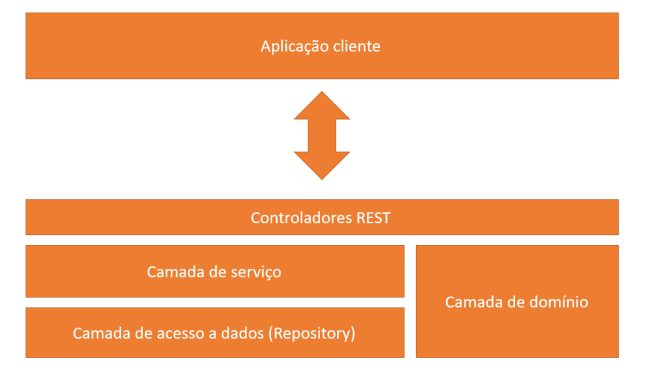
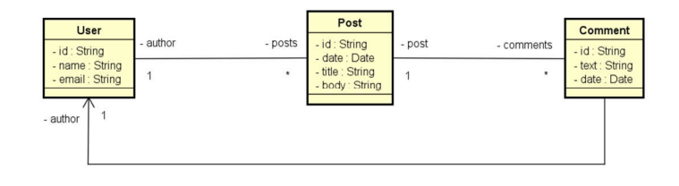

# WebService Workshop


# Sobre o projeto


Projeto Loja uma aplicação backend feita com Java Spring Boot e MongoDB, pelo curso do Nélio Alves pela Udemy.

Neste projeto, utilizamos Java Spring e MongoDB para implementar um CRUD como resposta para o frontend. Com as anotações do framework Spring, conseguimos configurar um banco de dados não relacional e criar um modelo básico de CRUD, aprendendo a usar o MongoDB e o Docker no processo.

Além disso, adicionamos um método DTO para os usuários e incluímos o encoding de comentários conforme o modelo HTTP. Utilizamos um modelo documentado para orientar a modelagem a objetos, garantindo o uso adequado das anotações do Spring.

O projeto também inclui a pesquisa do encoding como o @Query, tratamento de exceções e loops, resultando em uma solução completa e funcional.

## Camadas Lógicas
!

## Modelo Documentado


## Instância de domínio


# Tecnologias utilizadas
- Java
- Spring Boot
- MongoDB
- MongoDB Compass
- Maven
- Depêndencias

# Como executar o projeto

Pré-requisitos: Java 17 e Spring Boot 3 (Talvez o Spring Boot 2 supra as necessidades também)

## Clonar repositório
```bash
git clone https://github.com/Guhfrontend/loja-springboot-mongodb
```

# Autor

Gustavo Ribeiro da Silva

https://www.linkedin.com/in/gustavo-r13/

